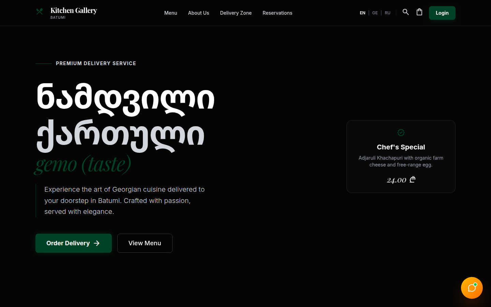
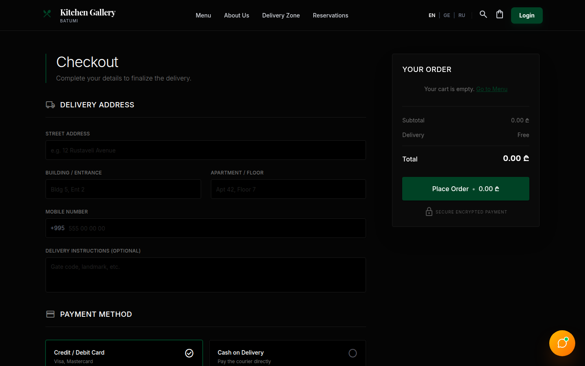
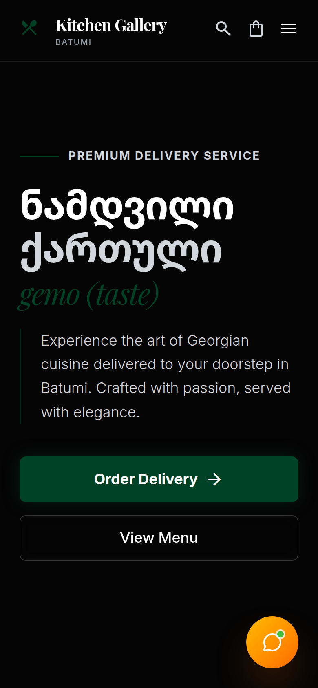

# Kitchen Gallery — Georgian Restaurant Ordering App

Front end for a Georgian food delivery service in Batumi: browse the menu, fill a cart, and manage your account and orders. Accounts, profile, and order history come from the [Tastify API](https://github.com/Davitxxdavit/testify-back) (NestJS).



| Checkout | Mobile |
| --- | --- |
|  |  |

## Features

- Menu grouped by category, with tabs that jump to each section (menu data is currently built into the app)
- Cart drawer saved in `localStorage`, so it survives page reloads
- Checkout page with delivery address, phone number, instructions, and card or cash payment (form layout; not yet sent to the API)
- Sign up, log in, and profile editing through the API; the JWT is attached to requests automatically
- Order history page loaded from the API
- About, Contact, and FAQ pages
- Support chat widget (interface only)
- Responsive dark design with Georgian typography and Framer Motion animations

## Built with

- React 19 and TypeScript
- Vite
- Tailwind CSS 4
- React Router 7
- Axios with request and response interceptors
- Framer Motion
- React Hot Toast
- Lucide icons

## Run locally

Requires Node.js 20+. The app expects the [Tastify API](https://github.com/Davitxxdavit/testify-back) to be running.

```bash
npm install
cp .env.example .env    # set VITE_API_ORIGIN, e.g. http://localhost:3000
npm run dev             # http://localhost:5173
npm run build           # type-check and build to dist/
```

## Project structure

```text
src/
├── pages/          Home, Menu, Checkout, Orders, Profile, Login, Register, About, Contact, FAQ
├── components/     CartDrawer, CategoryFilter, ProductCard, OrderCard, ChatWidget
│   ├── layout/     Navbar, Footer, Layout
│   └── ui/         Button, Card, Input, Badge
├── context/        AuthContext, CartContext
└── services/       Axios client and API services (auth, products, categories, orders, user)
```
